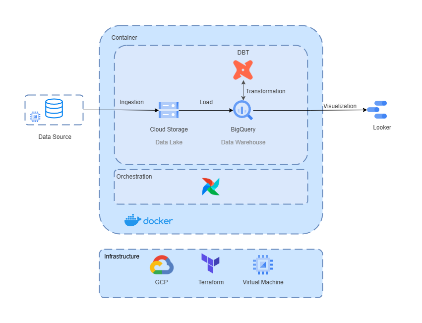
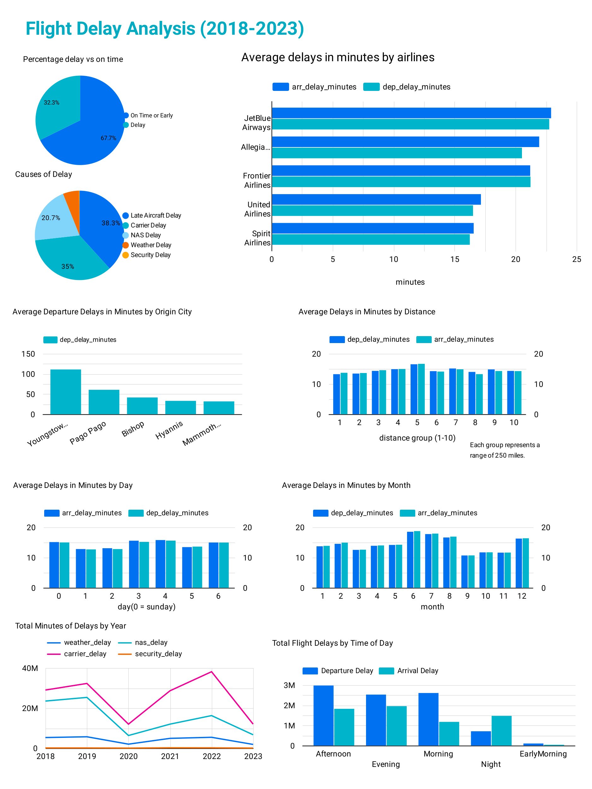

# Flight Delay Data Pipeline

## Description

This data pipeline project aims to automate the Extract, Load, and Transform (ELT) process for analyzing flight delays in the United States. In the modern world, time is a critical factor—especially in transportation and mobility. Understanding flight delay patterns can help improve decision-making for both passengers and stakeholders in the aviation industry.

To support this analysis, I collected a comprehensive dataset from Kaggle, covering flight records from 2018 to 2023, containing over 30 million rows. Despite the data being historical, it provides valuable insights into flight delay trends, seasonal patterns, and airline performance.

In this project, i use Terraform as Iac tools to create bucket cloud storage as data lake and bigquery as data warehouse, structured into three layers: raw, staging, and marts. All data pipeline steps is running inside a docker container and airflow is used to manage the flow for each steps.

### Main Objective:

- Develope automate data pipeline with airflow
- Create data models using dbt
- Visualize models in dashboard

## Tools and Tech

- Cloud: GCP
- Infrastructure as code (IaC): Terraform
- Orchestration: Airflow
- Data Warehouse: BigQuery
- Data Lake: Google Cloud Storage
- Data processing: dbt
- Container: Docker
- VM: Compute Engine
- Dashboard: Google Data Looker Studio

## Future Improvements

- Add data quality testing
- Set up automated notifications via email
- Implement table partitioning and clustering

## Design Architecture



## Dashboard


to see dashboard click [here](https://lookerstudio.google.com/u/0/reporting/b7cc53d9-202d-4fcd-80bf-4761bca49fd1/page/gAUMF/edit)

## How to run?

### 1. Create New GCP Project

1. Go to [Google Cloud Console](https://console.cloud.google.com/).
2. Create a new project.

### 2. Enable Required APIs

Enable these APIs in your project:

- **BigQuery API**
- **Compute Engine API**

### 3. Create a Virtual Machine

1. Open the **Compute Engine** menu.
2. Click **Create Instance**.
3. Choose **e2-standard-2** (2 vCPUs, 8 GB Memory).
4. Allow **HTTP traffic**.
5. Click **Create**.
6. Done!!

### 4. Open Port 8080 for Airflow UI

1. Go to **VPC Network** > **Firewall**.
2. Scroll down and click `default-allow-http`.
3. Click **Edit**.
4. Scroll down to **TCP Ports**, add `8080` (use comma separation)
   - for example: `80,8080`
5. Click **Save**.

---

### 5. Create a Service Account

1. Go to **IAM & Admin** > **Service Accounts**.
2. Click `+ CREATE SERVICE ACCOUNT`.
3. Name your service account and it will automatically generate a unique ID.
4. Continue to **Permissions**, then select:
   - `BigQuery Admin`
   - `Storage Admin`
5. Click **Done**.

---

### 6. VM Setup

1. Open your VM in **Compute Engine** menu.
2. Click **SSH**.
3. create installation.sh file:
   ```bash
   nano installation.sh
   ```
4. Copy and paste installation.sh file in this repo to your VM
5. Click `ctrl + x` then `y`and finally `enter` to save and exit
6. Allow access to installation.sh file, by running:
   ```bash
   chmod +x installation.sh
   ```
7. execute the scripts:
   ```bash
   ./installation.sh
   ```
8. Clone this GitHub repo:
   ```bash
   git clone https://github.com/mbintangww/Data-Pipeline-Project.git
   ```

### 7. Create Instance

1.  Navigate to the data-pipeline-project folder:
    ```bash
    cd data-pipeline-project
    ```
2.  Create `keys/` folder, add your **service account key** file and rename it to:

    ```
    gcp_credentials.json
    ```

3.  Navigate to the terraform folder:
    ```bash
    cd data-pipeline-project/terraform
    ```
4.  Create a `terraform.tfvars` file inside `terraform` folder
5.  Copy and paste code below to `terraform.tfvars` file

    ```
    project_id        = "your-project-id"
    region            = "ASIA"
    bucket_name       = "your-unique-gcs-bucket-name"
    stg_dataset_id    = "airflow_bq_dataset_stg"
    marts_dataset_id  = "airflow_bq_dataset_marts"
    raw_dataset_id    = "airflow_bq_dataset"
    secret_key        = "../keys/gcp_credentials.json"
    ```

    **Dont forget to change `project_id` and `bucket_name`**

6.  Run terraform:
    ```bash
    terraform init
    terraform apply
    ```

---

### 8. Prepare Folders

1. In your `data-pipeline-project`, create these folders:

   - `logs/`
   - `config/`
   - `keys/`

   Or just copy and paste command below:

   ```bash
   mkdir -p ./logs ./plugins ./config
   ```

2. Create a permission to file and container:
   ```bash
   echo -e "AIRFLOW_UID=$(id -u)\nAIRFLOW_GID=0" > .env
   ```

---

### 9. Docker Compose Setup

1. Navigate to `data-pipeline-project` folder.
2. Open `docker-compose.yaml` file.
3. Change these values with your own:

   ```yaml
   GCP__PROJECT_ID: your-project-id
   GCP__BUCKET_NAME: your-bucket-name
   AIRFLOW__API_AUTH_JWT_SECRET: jwt-secret-key
   AIRFLOW__WEBSERVER_SECRET_KEY: webserver-secret-key
   ```

   Note: You can generate the value of `AIRFLOW__API_AUTH_JWT_SECRET` and `AIRFLOW__WEBSERVER_SECRET_KEY` using openssl:

   ```bash
   openssl rand -hex 32
   ```

### 10. Build and Run Airflow

Make sure you're in the project root folder (`data-pipeline-project`) and run:

```bash
sudo docker compose build
```

```bash
sudo docker compose run airflow-init
```

```bash
sudo docker compose up -d
```

---

### 11. Upload Dataset

1.  You can download dataset from [here](https://www.kaggle.com/datasets/arvindnagaonkar/flight-delay/data).
2.  Extract and get a file with name `features_added.parquet`
3.  Upload `features_added.parquet` to local_data in your VM

---

### 12. Create connection in Airflow

1. Go to **Compute Engine** > **VM Instance**.
2. Copy and paste external IP
3. Open in browser:
   `http://{your-vm-external-ip}:8080`
4. Go to **Admin** >> **Connections** >>**Add Connection**

   Connection ID:`google_cloud_default`

   Connection Type:`google_cloud_platform`

   Project ID:`your-gcp-project-id`

   Keyfile Path:`/opt/airflow/keys/gcp_credentials.json`

---

### 13. Run DAG in Airflow

1. Navigate to **DAG** menu
2. first run `upload_data`, then run `dbt_models`
3. Now, you can open **BigQuery** menu in GCP to see all the DBT models that you made

---

## Congrats! it's all done. Your dbt models is now in BigQuery and you can explore it using tools like looker
